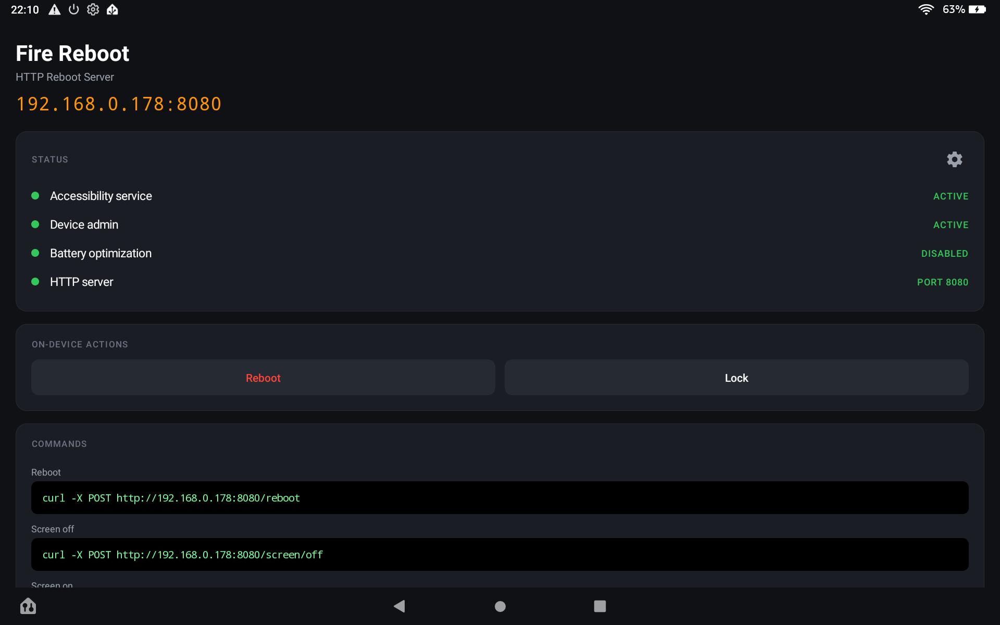
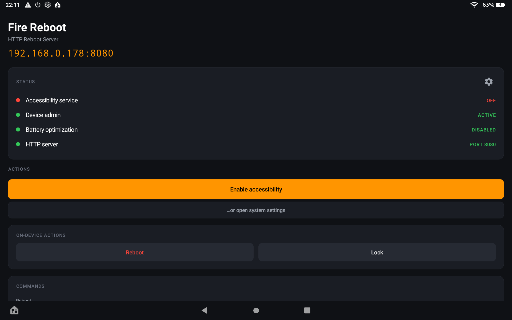
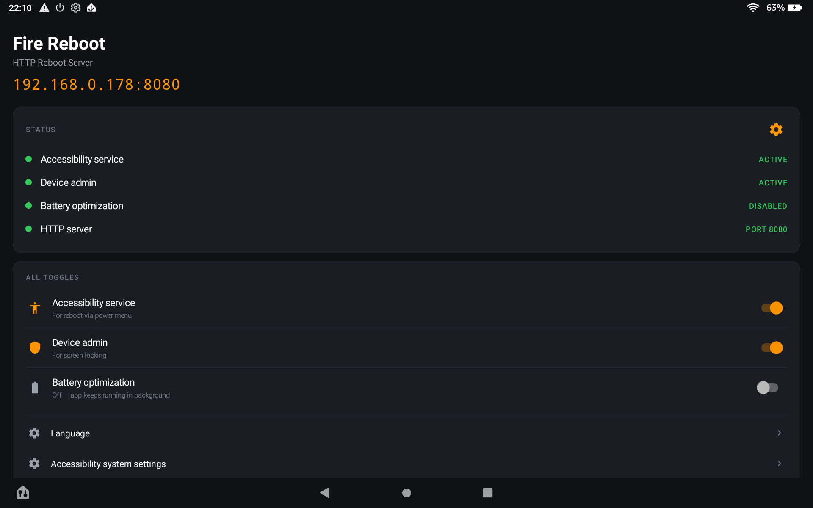

<p align="center">
  
</p>

<h1 align="center">Fire Reboot</h1>

HTTP-controlled **reboot**, **screen lock**, and **screen wake** for Android / Fire OS tablets.

Designed for wall-mounted Fire tablets running a Home Assistant dashboard — fills the gaps that the HA Companion App cannot handle without root.



- ~70 KB APK (R8-minified), no external dependencies
- Pure plain-Android UI (no Material library, no AppCompat)
- Localized: English (default), German
- Auto-starts after device boot

## Features

| Endpoint | Action | Mechanism |
|---|---|---|
| `POST /reboot` | Reboot tablet | Accessibility — opens power menu, taps "Restart" |
| `POST /screen/off` | Lock screen | `DevicePolicyManager.lockNow()` (preferred) or accessibility |
| `POST /screen/on` | Wake display | Tiny invisible Activity with `setTurnScreenOn(true)` + wake-lock |

## Requirements

- Android 9 (API 28) or higher
- Tested on **Fire HD 10 Plus 11. Gen** (`KFTRPWI`), Fire OS 7.3.x

## Installation

1. Download the APK from the [Releases](../../releases) page (or build from source).
2. Sideload via ADB:
   ```bash
   adb install fire-reboot.apk
   ```
3. Open the app once on the tablet.
4. Tap the **gear icon** (top right of the *STATUS* card) to open advanced settings.
5. Enable, in this order:
   - **Accessibility service** — required for `/reboot`.
   - **Device admin** — required for `/screen/off` (preferred over accessibility lock).
   - **Battery optimization disabled** — required for reliable auto-start after device boot.

### Optional one-time ADB grants

For the in-app **1-click toggle** of accessibility (instead of having to go through system settings each time the APK is updated):

```bash
adb shell pm grant de.hysight.firereboot android.permission.WRITE_SECURE_SETTINGS
```

For unconditional whitelist from Doze / battery optimization:

```bash
adb shell dumpsys deviceidle whitelist +de.hysight.firereboot
```

## HTTP API

Default port: **8080**. Override at build time with `-PREBOOT_PORT=8089`.

```bash
curl -X POST http://<tablet-ip>:8080/reboot
curl -X POST http://<tablet-ip>:8080/screen/off
curl -X POST http://<tablet-ip>:8080/screen/on
```

The current IP and port are shown prominently at the top of the in-app UI.

## Home Assistant integration

`configuration.yaml`:

```yaml
rest_command:
  tablet_reboot:
    url: http://<tablet-ip>:8080/reboot
    method: POST
  tablet_screen_off:
    url: http://<tablet-ip>:8080/screen/off
    method: POST
  tablet_screen_on:
    url: http://<tablet-ip>:8080/screen/on
    method: POST
```

Then call `rest_command.tablet_reboot` from any automation / script. Pairs naturally with the HA Companion App, which already covers brightness, volume, notifications, and webview commands — Fire Reboot only does the things Companion App cannot do without root.

## Build from source

Requires JDK 17 and an Android SDK with platforms 34 and build-tools 35+.

```bash
git clone https://github.com/<your-username>/firetablet-reboot.git
cd firetablet-reboot
./gradlew assembleRelease
# APK at app/build/outputs/apk/release/app-release.apk
```

The release build is signed with the local Android debug keystore (`~/.android/debug.keystore`) so you can sideload immediately. The same keystore is used across all your local debug builds, so an APK replacement looks like an in-place update. To publish as a separate identity, configure a real keystore via `signingConfigs` — the README intentionally does not.

For a faster debug build without R8 minification:

```bash
./gradlew assembleDebug
```

## Fire OS quirks

A few Fire-OS-specific things to know:

- After every APK update Android automatically disables the accessibility service (security feature). Re-enable in the **Accessibility** settings, or run `adb reboot` — the AccessibilityManagerService rebinds on a fresh boot. The HTTP service itself restarts automatically via `MY_PACKAGE_REPLACED`.
- If port 8080 is already in use on the tablet (some apps run their own HTTP server), build with `-PREBOOT_PORT=8089` or another free port.

## Screenshots

| Onboarding | Advanced settings |
|---|---|
|  |  |
| When something is missing, the app surfaces a single primary CTA. | Tap the gear in the STATUS card for all toggles, language picker, and direct links to system settings. |

## Credits

App icon and toolbar icons (power, settings, accessibility, shield, battery, chevron)
are from [Google Material Symbols](https://fonts.google.com/icons), used under the
[Apache License 2.0](https://www.apache.org/licenses/LICENSE-2.0). See
[`NOTICE`](NOTICE) for the attribution text.

## License

The application source code is licensed under the [MIT License](LICENSE).
Bundled Material icons remain under their original Apache 2.0 license — see [`NOTICE`](NOTICE).
